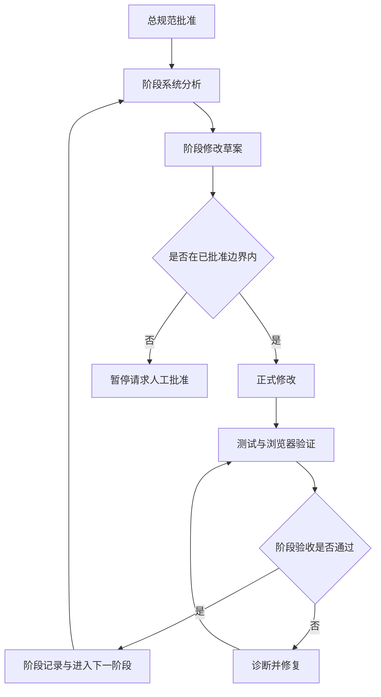

# 量化系统长期无人值守改造 Implementation Plan

> **For Claude:** REQUIRED SUB-SKILL: Use superpowers:executing-plans to implement this plan task-by-task.
> **For Codex:** 按本文档逐阶段、逐任务执行。未收到人工批准前，只允许完善计划和校验文档，不允许进入正式代码修改。

**Goal:** 分阶段长期改造量化系统，使其从真实数据 demo 原型升级为可解释、可复跑、可展示、可继续生产化的量化系统。

**Architecture:** 保持现有 FastAPI + React + SQLite 基线，先强化报告、回测、数据源和管理端工作流，再引入指标层、迁移体系、数据库运维和模拟交易监控。所有阶段都通过 snapshot、provider registry、service 层和 API 契约渐进演进，避免一次性重写。

**Tech Stack:** Python, FastAPI, SQLAlchemy, pytest, Tushare Pro, SQLite, future PostgreSQL/TimescaleDB, React, TypeScript, Vite, Playwright/browser smoke verification.

---

日期：2026-06-02

状态：已批准执行

适用项目：`E:\Project\quant`

本文档用于把后续量化系统改造一次性梳理完整。批准前不进入正式代码修改；批准后，执行 agent 可以按本文档分阶段无人值守推进，只有触发停止条件时才暂停并请求人工确认。

## 1. 总目标

把当前系统从“可以完成真实数据演示的原型系统”改造成“适合客户 demo、可解释、可复跑、可逐步生产化”的量化展示系统。

核心目标分为四类：

1. 客户 demo 效果：报告页面更完整、更可信，能清楚展示策略收益、风险、交易过程、数据来源和限制。
2. 量化能力：回测逻辑从简单信号演示升级为可解释的资金、仓位、费用、滑点、指标和风控流程。
3. 数据能力：Tushare 真实数据链路稳定可用，预留 JQData、AkShare、BaoStock 和未来数据库化落地。
4. 工程治理：测试、迁移、文档、验收和停止条件明确，支持较长周期连续改造。

## 2. 当前基线

当前系统已经完成第一轮真实数据接入和客户报告验证。

已确认能力：

- 后端可启动，健康检查能暴露依赖、调度器和数据源配置状态。
- Tushare 已作为主数据源接入，支持日线和分钟线经 `ts.pro_bar` 获取并归一化。
- 代码内部使用 `exchange` 加证券代码，adapter 内部转换为 Tushare `ts_code`。
- 默认前复权 `qfq`，同时预留空复权、`qfq`、`hfq` 参数。
- Provider registry 已预留 Tushare、JQData、AkShare、BaoStock。
- 数据库 schema 已补充 provider、adjust、frequency、import task 字段等基础结构。
- 使用贵州茅台 `600519.SH` 的真实 Tushare 数据跑通一次回测和客户报告。
- 后端测试已通过：`35 passed`。
- `frontend-display` 构建已通过，只有 Vite chunk size 警告。
- 本地报告页面已用浏览器验证：指标区、K 线区、交易表、假设和风险披露可展示。

当前真实演示基线：

- 标的：贵州茅台 `600519.SH`
- 数据区间：2024-01-01 至 2026-05-29
- 复权：前复权 `qfq`
- 数据条数：580 bars
- 回测 ID：114
- 快照 ID：73
- 分享链接 ID：91
- 回测结果：累计收益约 `-15.41%`，最大回撤约 `-27.28%`，交易次数 `157`，胜率约 `43.95%`
- 说明：报告访问 token 不写入本文档，避免把可访问凭据固化进版本库。

相关已有文档：

- `docs/external-audit-jzhu-trading.md`
- `docs/project-status-demo-plan-2026-06-02.md`
- `docs/quant-system-prd-and-architecture.md`
- `docs/client-report-redesign-research.md`

## 3. 无人值守执行边界

批准后，agent 可以在以下边界内连续执行：

1. 可以修改后端、前端、测试和文档，只要修改属于本文档列出的阶段范围。
2. 可以新增非破坏性数据库字段、模型、测试、脚本和文档。
3. 可以运行本地测试、构建、浏览器验证、最小量真实 Tushare smoke test。
4. 可以修复执行中暴露出的同范围缺陷，例如字段兼容、接口契约、展示格式、测试夹具问题。
5. 可以更新阶段内的实现细节，但不能改变阶段目标、扩大业务范围或引入未批准的外部付费服务。

必须遵守的限制：

- 不打印、不提交、不硬编码任何真实密钥、token、账号或私有分享链接。
- 不回滚用户已有修改；遇到同文件冲突时先理解并保留用户意图。
- 不执行破坏性数据库操作，例如直接删除数据、重建生产库、清空表。
- 不做真实交易，不接券商下单接口，不把 paper trading 伪装成实盘。
- 不新增需要付费购买的外部数据源调用，除非用户明确提供账号和授权。
- 不把“修改草案”阶段误当成正式修改；只有本文档被批准后才进入代码实施。

## 4. 停止条件

执行中只在以下情况暂停并请求人工确认：

1. 需要破坏性 schema 迁移、数据清空、历史数据不可逆变更。
2. 需要新的真实账号、付费数据源、外部服务密钥或生产部署权限。
3. 自动测试连续修复后仍无法恢复，且失败原因不属于本阶段修改范围。
4. 发现用户在同一文件中有未合并的业务改动，继续编辑会高概率覆盖用户意图。
5. 真实数据源连续失败，无法判断是网络、额度、权限、接口变更还是代码问题。
6. 阶段实现需要新增本文档没有批准的大功能。
7. 需要对客户口径作出产品承诺，例如“可稳定盈利”“可直接实盘使用”。

未触发停止条件时，应继续推进到当前阶段验收完成。

## 5. 工作流规范

后续仍保持“系统分析 → 修改草案 → 正式修改”的工作流，但在长期 goal 内做成阶段化循环。

### 5.1 总流程

### 5.2 阶段系统分析

每个阶段开始前，agent 需要快速完成：

- 读取相关模块和测试，确认当前实现状态。
- 对照本文档确认本阶段目标和不做范围。
- 识别用户已有改动和潜在冲突文件。
- 写出阶段内最小修改面。

阶段系统分析不需要等待用户批准，除非发现停止条件。

### 5.3 阶段修改草案

每个阶段正式改代码前，agent 需要在执行记录或阶段文档中写明：

- 准备修改哪些后端模块。
- 准备修改哪些前端模块。
- API 或数据库字段是否变化。
- 测试如何覆盖。
- 本阶段验收口径。

如果草案完全落在本文档批准范围内，可以自动进入正式修改。

### 5.4 正式修改

正式修改应满足：

- 小步提交式编辑，尽量按后端、测试、前端、文档分块推进。
- 先保证现有测试不退化，再补新增测试。
- 每阶段结束都留下清楚的验证结果。
- 对真实数据 smoke test 保持最小调用量，避免浪费 Tushare 额度。

## 6. 总体目标架构

长期目标不是一次性重写，而是在现有系统上稳步升级。

目标模块边界：

- 后端 API 层：负责接收管理端、展示端请求，保持接口契约清晰。
- 数据源层：统一 provider registry、数据拉取、复权、频率、字段归一化。
- 存储层：短期继续 SQLite，后续引入迁移体系，再平滑到 PostgreSQL/TimescaleDB。
- 回测层：负责策略参数、指标、信号、撮合、资金、仓位、成本、绩效。
- 报告快照层：负责把一次回测固化为不可变客户报告，保证展示可复现。
- 展示前端：面向客户，强调可读性、可信度、交易过程披露和风险说明。
- 管理前端：面向操作者，强调数据导入、回测运行、报告生成、状态诊断。
- 调度和监控层：负责数据更新、任务状态、失败记录和后续 paper trading。

## 7. 阶段路线图

建议按 Phase 0 到 Phase 8 顺序推进。Phase 0 到 Phase 4 优先服务 demo 效果；Phase 5 到 Phase 8 提升长期可维护性和成熟度。

### Phase 0：基线冻结与演示保护

目标：

- 固化当前能跑通的真实数据 demo。
- 建立后续改造前的安全基线。
- 避免后续修改破坏现有客户报告链路。

用户可见效果：

- 暂无明显新功能。
- 后续 demo 链路更稳定。

重点模块：

- `backend/tests/`
- `frontend-display/`
- `docs/`
- 可选新增 `scripts/` 或 `tools/` 下的 smoke 脚本。

修改内容：

- 增加客户报告 smoke test 或最小端到端校验脚本。
- 记录当前茅台真实回测的复跑步骤，但不写入私密 token。
- 检查前端展示页对旧 snapshot 字段的兼容性。
- 明确本地端口和数据库文件选择，避免 8000/8001、5174/5184 混用造成误判。

测试要求：

- 后端完整测试通过。
- `frontend-display` 构建通过。
- 浏览器能打开现有客户报告页面。

验收标准：

- 当前报告不因为新增校验而失败。
- 文档能让后续 agent 明确如何复跑 demo。
- 没有引入任何业务行为变化。

不做范围：

- 不重写回测引擎。
- 不调整前端视觉。
- 不改数据库结构，除非只是测试夹具需要。

停止条件：

- 当前真实报告无法访问，且无法判断是端口、数据库还是代码问题。

### Phase 1：客户报告成熟化

目标：

- 让客户看到更完整、更专业的回测结果。
- 把报告从“能展示”升级为“能讲清楚”。

用户可见效果：

- 报告顶部能展示策略、标的、区间、数据源、复权、生成时间。
- 指标区增加年化收益、波动率、Sharpe、Calmar、收益回撤比、平均盈亏等。
- 交易记录支持更好的滚动披露或分组展示。
- 风险假设和数据说明更清楚。

重点模块：

- `backend/app/services/backtest.py` 或当前回测服务模块
- `backend/app/api/snapshots.py`
- `backend/app/models/core.py`
- `frontend-display/src/App.tsx`
- `frontend-display/src/App.css`
- `backend/tests/`

修改内容：

- 扩展 report snapshot payload，增加 `report_summary`、`data_summary`、`risk_metrics`、`trade_summary`。
- 指标计算优先在后端完成，前端只负责展示和格式化。
- 交易表增加滚动区域、空状态、长表不撑破页面。
- 旧 snapshot 缺少新字段时前端仍能正常展示。
- 报告内明确显示“模拟回测，不构成投资建议”。

API 和数据影响：

- 分享报告响应可以新增字段。
- 不删除旧字段。
- 旧报告快照必须兼容。

测试要求：

- 后端增加指标计算和 snapshot 兼容测试。
- 前端构建通过。
- 浏览器验证桌面宽度和移动宽度主要区域不重叠。

验收标准：

- 客户报告无需解释代码也能看出策略结果、风险和交易过程。
- 指标数值与后端测试样例一致。
- 老报告可打开，新报告字段更丰富。

不做范围：

- 不改变回测交易逻辑本身。
- 不引入新数据源。

停止条件：

- 现有 snapshot 结构无法兼容，必须做破坏性迁移。

### Phase 2：回测引擎真实化

目标：

- 把回测从信号演示升级为更接近真实交易流程的模拟撮合。
- 让策略参数真正影响仓位、交易、收益和风险。

用户可见效果：

- 回测报告中的交易和收益更可信。
- 可以解释每笔交易为什么发生、成本如何计算、仓位如何变化。

重点模块：

- `backend/app/services/backtest.py`
- `backend/app/api/backtests.py`
- `backend/app/models/core.py`
- `backend/tests/`
- 管理端相关回测表单和结果页面。

修改内容：

- 建立统一的 portfolio state：现金、持仓数量、市值、总权益、仓位比例。
- 应用 `initial_cash`、`base_position_pct`、`trade_position_pct` 等参数。
- 支持手续费、滑点、最小交易约束的基础模型。
- 明确买入、卖出、调仓、无交易的信号状态。
- 记录每笔交易的日期、方向、价格、数量、金额、费用、滑点、交易后仓位。
- 生成逐日 equity curve、drawdown curve、position curve。

API 和数据影响：

- 回测结果 payload 可新增 `equity_curve`、`drawdown_curve`、`position_curve`、`orders`。
- 已有 `trades` 字段保持兼容。
- 数据库字段优先以 snapshot JSON 承载，避免早期 schema 膨胀。

测试要求：

- 用小型手工数据测试买卖、费用、滑点、仓位变化。
- 测试空数据、单日数据、无交易、连续上涨、连续下跌。
- 后端完整测试通过。

验收标准：

- 回测收益能由 equity curve 推导。
- 交易记录和持仓曲线一致。
- 参数变化会产生可解释的结果变化。

不做范围：

- 不实现多标的组合回测。
- 不实现复杂撮合队列。
- 不接实盘交易。

停止条件：

- 当前策略参数定义与用户业务口径冲突，需要重新定义产品规则。

### Phase 3：管理端数据工作流

目标：

- 让操作者能通过管理端完成真实数据导入、回测、报告生成，而不是依赖脚本。
- 把 Tushare 主源状态清楚地展示给操作者。

用户可见效果：

- 管理端可选择数据源、复权、频率、日期范围。
- 导入任务能看到导入行数、更新行数、失败原因。
- JQData 显示为预留未配置，不误导为可用。
- AkShare 可作为后续免费兜底入口，但第一批仍以 Tushare 为主。

重点模块：

- `backend/app/api/market_data.py`
- `backend/app/api/market_data_schedules.py`
- `backend/app/services/market_data.py`
- `backend/app/services/bootstrap.py`
- `frontend-admin/`
- `backend/tests/`

修改内容：

- 管理端表单增加 provider、adjust、frequency 的选择。
- 默认 provider 为 Tushare。
- 健康检查和数据源状态在管理端可见。
- 导入任务结果展示 `rows_imported`、`rows_updated`、`request_params`、错误信息。
- 避免在前端展示密钥，只展示配置状态。

API 和数据影响：

- 数据导入 API 保持兼容，可新增 provider 参数。
- health API 可继续扩展 provider 状态。
- 不要求新建复杂数据源管理页面，先满足 demo 操作链路。

测试要求：

- 后端 provider 参数兼容测试。
- 管理端构建通过。
- 浏览器验证导入和回测主流程。

验收标准：

- 不写脚本也能复现“导入茅台数据 → 跑回测 → 生成客户报告”的路径。
- 未配置 JQData 时，界面状态明确，不报未知错误。

不做范围：

- 不购买或正式接入 JQData。
- 不实现 BaoStock 拉取。
- 不做复杂权限系统。

停止条件：

- 管理端当前结构与 API 状态不一致，需要较大范围重构。

### Phase 4：数据质量与交易日历

目标：

- 让系统能识别真实行情数据是否完整。
- 报告中能披露缺失、停牌、非交易日等影响结果解释的问题。

用户可见效果：

- 导入完成后能看到数据覆盖率。
- 报告能提示数据缺失或样本不足。
- 客户能理解“没有数据”和“策略没交易”的区别。

重点模块：

- `backend/app/services/market_data.py`
- `backend/app/models/core.py`
- `backend/app/services/schema.py`
- `backend/app/api/market_data.py`
- `backend/tests/`

修改内容：

- 使用 Tushare 交易日历或 provider calendar 接口建立交易日检查。
- 对日线数据计算应有交易日、实际 bars、缺失交易日。
- 对分钟线先提供基础完整性说明，暂不追求全市场分钟级精确校验。
- 导入任务记录数据质量摘要。
- 回测前检查样本数量，不足时给出 warning。
- 报告中展示数据质量 warning。

API 和数据影响：

- 可新增 `data_quality` 字段。
- 可新增数据库字段或以 JSON 承载质量摘要。
- 不破坏现有 bars 唯一键。

测试要求：

- 构造缺失交易日样例测试。
- 测试空数据、连续缺失、区间首尾缺失。
- 后端完整测试通过。

验收标准：

- 数据不完整时不是静默通过。
- 报告和管理端都能看到可解释 warning。

不做范围：

- 不做逐 tick 质量校验。
- 不做跨 provider 自动纠错。

停止条件：

- Tushare 日历接口权限不足或返回结构变化，需要重新评估 provider 能力。

### Phase 5：指标层和策略解释

目标：

- 把常用技术指标从前端临时计算或隐式逻辑中抽离到后端。
- 让策略信号更容易解释和测试。

用户可见效果：

- 报告中可以看到关键指标和信号依据。
- 管理端能更清楚地解释策略参数含义。

重点模块：

- `backend/app/services/indicators.py`，如不存在则新增。
- `backend/app/services/backtest.py`
- `backend/tests/`
- `frontend-display/`
- `frontend-admin/`

修改内容：

- 后端实现 MA、EMA、MACD、RSI、BOLL 等第一批指标。
- 指标计算返回统一时间序列格式。
- 策略使用指标服务，避免散落计算。
- snapshot 中保存本次报告需要展示的指标摘要或序列。
- 前端展示关键指标线和信号说明。

API 和数据影响：

- 可新增指标查询 API，但优先服务回测和报告。
- snapshot 可新增 `indicators` 字段。

测试要求：

- 使用已知样例验证指标计算。
- 测试短窗口、缺失值、窗口不足。
- 后端完整测试通过。

验收标准：

- 指标输出可复现。
- 回测信号来源可解释。
- 前端展示不依赖重新计算核心指标。

不做范围：

- 不做机器学习策略。
- 不做指标参数自动优化。

停止条件：

- 现有策略定义过于模糊，无法确定指标和信号关系。

### Phase 6：数据库与运维硬化

目标：

- 从“SQLite 便于开发”逐步走向“可迁移、可备份、可部署”的数据库治理。
- 为后续 PostgreSQL/TimescaleDB 做准备。

用户可见效果：

- demo 操作者感知较少，但系统稳定性提升。
- 后续部署更可信。

重点模块：

- `backend/app/core/database.py`
- `backend/app/services/schema.py`
- `backend/app/models/core.py`
- `alembic/`，如不存在则新增。
- `docker-compose.yml` 或部署相关文件。
- `backend/tests/`

修改内容：

- 引入 Alembic migration baseline。
- 把当前自动补 schema 逻辑整理为开发兜底，正式迁移交给 migration。
- 明确 SQLite 与 PostgreSQL 的兼容范围。
- 预留 TimescaleDB hypertable 设计说明，但不急于强制切换。
- 增加数据库 readiness、备份、恢复和迁移文档。

API 和数据影响：

- 可能新增 migration 文件。
- 不自动迁移用户真实数据到 PostgreSQL，除非另行批准。

测试要求：

- SQLite 下现有测试通过。
- migration 在空库可执行。
- 如果本地有 PostgreSQL 测试环境，再增加可选测试，不作为第一验收硬门槛。

验收标准：

- 新环境能通过 migration 建库。
- 现有 SQLite 开发流程不被打断。
- schema 变更有历史记录。

不做范围：

- 不直接替换生产数据库。
- 不把 TimescaleDB 作为强制依赖。

停止条件：

- 当前数据需要不可逆迁移。
- 本地或部署环境缺少数据库权限。

### Phase 7：模拟交易与监控成熟化

目标：

- 把 paper trading 从概念入口升级为内部可追踪的模拟执行和监控模块。
- 为后续演示“策略监控”能力打基础。

用户可见效果：

- 管理端能看到模拟运行状态、信号、模拟成交、失败原因。
- 客户报告仍以回测为主，不把模拟交易当成实盘。

重点模块：

- `backend/app/api/paper_runs.py`
- `backend/app/models/core.py`
- `backend/app/scheduler/`
- `backend/tests/`
- `frontend-admin/`

修改内容：

- 明确 PaperRun、PaperSignal、PaperTrade 的数据结构。
- 调度器记录每次执行输入、输出、错误。
- 支持 watchlist 或单标的策略监控。
- 增加失败重试和状态标记。
- 管理端展示运行历史。

API 和数据影响：

- 可新增 paper signal/trade 相关表或 JSON payload。
- 不接真实下单。

测试要求：

- 调度器任务测试。
- paper run 状态流转测试。
- 管理端构建通过。

验收标准：

- paper run 能解释“何时运行、看了什么数据、产生什么信号、是否模拟成交”。
- 失败不会静默消失。

不做范围：

- 不接券商 API。
- 不做实时行情。

停止条件：

- 用户要求实盘交易或自动下单，需要重新做风控和权限设计。

### Phase 8：演示打包与交付治理

目标：

- 形成可重复演示、可交付说明、可继续开发的项目状态。

用户可见效果：

- 客户 demo 更顺畅。
- 项目资料能支持销售讲解、技术讲解和后续开发。

重点模块：

- `docs/`
- `scripts/`
- `frontend-display/`
- `frontend-admin/`
- `backend/tests/`

修改内容：

- 编写 demo runbook：启动、导入、回测、生成报告、打开报告。
- 编写客户讲解口径：系统做什么、不做什么、当前边界。
- 准备一套固定样例数据或固定复跑脚本。
- 整理测试矩阵和发布前 checklist。
- 汇总外部系统审计吸收情况。

测试要求：

- 按 runbook 从空环境或干净数据库跑一次。
- 后端测试通过。
- 前端构建通过。
- 浏览器验证报告和管理端主流程。

验收标准：

- 新 agent 或新开发者能按文档复现 demo。
- 客户沟通材料不夸大系统能力。
- 当前薄弱点和下一步风险清楚记录。

不做范围：

- 不制作正式商业合同、投顾合规文件。
- 不承诺生产 SLA。

停止条件：

- 需要客户品牌、公司法务、投顾合规口径确认。

## 8. 优先级

最高优先级：

1. Phase 0：保护当前真实 demo。
2. Phase 1：客户报告成熟化。
3. Phase 2：回测引擎真实化。
4. Phase 3：管理端真实数据工作流。

中优先级：

5. Phase 4：数据质量与交易日历。
6. Phase 5：指标层和策略解释。

后续优先级：

7. Phase 6：数据库与运维硬化。
8. Phase 7：模拟交易与监控成熟化。
9. Phase 8：演示打包与交付治理。

原因：

- 客户 demo 首先看报告是否可信、回测是否能解释、数据是否真实。
- 数据库生产化很重要，但当前用户已确认“稳定后再做数据库”。
- JQData 暂未购买，BaoStock 第一批不实现，所以数据源扩展应预留结构，先把 Tushare 链路做稳。

## 9. 跨阶段验收门禁

每个涉及代码的阶段至少执行：

- 后端测试：`.venv\Scripts\python.exe -m pytest backend\tests`
- 涉及展示端时：在 `frontend-display` 执行 `npm.cmd run build`
- 涉及管理端时：在 `frontend-admin` 执行对应构建命令，以项目实际脚本为准
- 涉及客户报告时：用 in-app browser 或 Playwright 打开本地报告，检查核心区域非空、无重叠、无新增控制台错误
- 涉及真实数据时：只做最小量 Tushare smoke test，并记录调用目标、日期区间、数据行数

阶段验收记录需要包含：

- 修改摘要。
- 测试命令和结果。
- 浏览器验证结果。
- 未完成事项和已知风险。

## 10. 数据源策略

当前批准的数据源策略：

- 主源：Tushare Pro
- 补充：JQData，账号未购买，暂不正式接入
- 免费兜底：AkShare + BaoStock
- 第一批正式接入：只做 Tushare
- BaoStock：只保留 provider registry 预留，不实现拉取

长期实现原则：

- 内部代码统一使用 `symbol + exchange` 或已有项目中的 instrument 模型。
- provider adapter 负责转换外部代码格式，例如 Tushare `ts_code`。
- 日线和分钟线优先通过 `ts.pro_bar`，统一复权和归一化。
- 后端 API 保持当前日期格式，adapter 内部转换 provider 需要的日期格式。
- 未配置 provider 在 health 中标记未配置，调用时报清楚错误。
- 自动测试默认不依赖真实外网；真实 Tushare 只在全部自动测试通过后做最小量测试。

## 11. 数据库策略

当前策略：

- 短期继续使用当前数据库实现，优先保证 demo 和功能稳定。
- 数据库正式迁移和 TimescaleDB 生产化在系统稳定后推进。

长期策略：

- Phase 6 前不要为了“看起来成熟”强行重构数据库。
- schema 变更优先保持向后兼容。
- 真实迁移前必须先有 migration、备份、恢复和回滚说明。
- TimescaleDB 可以作为目标部署方案，但不能成为本地开发和测试的阻塞项。

## 12. 前端展示策略

展示端原则：

- 第一屏要直接服务客户报告，而不是产品营销页。
- 图表、指标、交易表和风险说明是主体。
- 不使用大段说明文字替代数据展示。
- 长交易记录必须可滚动、可折叠或分页，不能撑破页面。
- 旧 snapshot 和新 snapshot 都要兼容。
- 移动端至少保证核心指标和摘要可读，不重叠。

管理端原则：

- 优先完成真实工作流，而不是装饰性首页。
- 表单默认值要符合当前策略：Tushare、日线、前复权。
- 未配置能力要清楚显示，不让操作者误以为系统坏了。

## 13. 测试策略

后端测试分层：

- 纯函数测试：指标、日期转换、代码转换、指标计算、绩效计算。
- 服务测试：数据导入、回测、snapshot、provider registry。
- API 测试：market data、backtests、reports、health、paper runs。
- 兼容测试：旧 payload、缺字段、空数据、未配置 provider。

前端验证分层：

- 构建通过是最低门槛。
- 对报告页做浏览器 smoke test。
- 对关键视觉区域检查非空、无重叠、长表不撑破布局。
- 对旧 report payload 做兼容样例。

真实数据测试原则：

- 不把真实 Tushare 调用放进常规 pytest。
- 只有在本地自动测试通过后，才运行最小 smoke。
- smoke 区间尽量短，除非阶段目标明确需要完整 demo 复跑。

## 14. 文档策略

每个阶段结束至少更新以下内容之一：

- 阶段执行记录。
- demo runbook。
- API 或数据结构说明。
- 项目状态文档。
- 已知风险和下一阶段计划。

文档写法：

- 面向客户讲解的内容避免深入技术架构。
- 面向开发执行的内容要写清模块、文件、验收和停止条件。
- 对投顾、收益、风险保持谨慎表述。

## 15. 批准后建议执行顺序

批准后建议按以下顺序连续推进：

1. Phase 0：1 个小阶段，预计主要是文档和 smoke 保护。
2. Phase 1：客户报告成熟化，优先产生 demo 可见提升。
3. Phase 2：回测引擎真实化，修正客户可能追问的核心逻辑。
4. Phase 3：管理端数据工作流，减少演示时对脚本依赖。
5. Phase 4：数据质量与交易日历，提高数据可信度。
6. Phase 5：指标层和策略解释，提高策略可解释性。
7. Phase 6：数据库与运维硬化，进入长期工程治理。
8. Phase 7：模拟交易与监控成熟化，补齐后续产品叙事。
9. Phase 8：演示打包与交付治理，形成可复跑交付状态。

## 16. 无人值守执行台账

批准后，执行 agent 应把本表当作长期 goal 的状态台账。状态只能使用 `pending`、`in_progress`、`verified`、`paused`。

| Phase | 状态 | 主要交付 | 验收门禁 |
| --- | --- | --- | --- |
| Phase 0 基线冻结与演示保护 | verified | demo runbook、smoke 校验、现有报告保护 | 后端测试、展示端构建、报告浏览器 smoke |
| Phase 1 客户报告成熟化 | verified | 更完整的报告 payload、指标区、交易披露、风险说明 | 后端指标测试、展示端构建、桌面/移动报告验证 |
| Phase 2 回测引擎真实化 | verified | 资金、仓位、费用、滑点、equity/drawdown/position curves | 手工数据回测测试、完整后端测试 |
| Phase 3 管理端数据工作流 | verified | provider/adjust/frequency 表单、导入结果、状态展示 | 管理端构建、API 测试、端到端操作 smoke |
| Phase 4 数据质量与交易日历 | verified | 交易日历、缺失数据 warning、质量摘要 | 数据质量测试、报告 warning 验证 |
| Phase 5 指标层和策略解释 | verified | 指标服务、策略信号解释、snapshot 指标字段 | 指标样例测试、报告展示验证 |
| Phase 6 数据库与运维硬化 | verified | Alembic baseline、迁移文档、Postgres/TimescaleDB 路线 | migration 空库验证、SQLite 回归测试 |
| Phase 7 模拟交易与监控成熟化 | verified | PaperSignal/PaperTrade、调度记录、失败状态 | paper run 状态流转测试、管理端 smoke |
| Phase 8 演示打包与交付治理 | pending | demo runbook、客户讲解口径、交付 checklist | 按 runbook 复跑、全量测试与构建 |

每个 Phase 完成后必须追加阶段记录，至少包含：

- 阶段开始日期和结束日期。
- 修改文件。
- 测试命令和结果。
- 浏览器验证 URL 或截图文件。
- 是否触发停止条件。
- 下一阶段进入条件是否满足。

## 17. 分阶段任务清单

本节用于正式执行。批准后从 Task 0.1 开始，除非触发停止条件，否则按顺序推进。每个任务完成后都应更新阶段记录。

### Phase 0 Tasks：基线冻结与演示保护

**Task 0.1：复核当前基线**

Files:

- Read: `docs/project-status-demo-plan-2026-06-02.md`
- Read: `docs/external-audit-jzhu-trading.md`
- Read: `backend/tests/`
- Read: `frontend-display/src/App.tsx`
- Read: `frontend-display/src/App.css`

Steps:

1. Run `git status --short` and record dirty files.
2. Run `rg --files` and confirm backend/admin/display/docs structure.
3. Read existing demo and audit docs.
4. Identify user-modified files that must not be overwritten.
5. Record baseline in a new stage note under `docs/`.

Expected result:

- No business code changes.
- A clear written baseline exists before further work.

**Task 0.2：补 demo runbook**

Files:

- Create: `docs/demo-runbook.md`
- Modify: `docs/project-status-demo-plan-2026-06-02.md`

Steps:

1. Write the start commands for backend, admin frontend, and display frontend.
2. Document how to choose the correct local database and port.
3. Document the Moutai demo replay path without writing private token.
4. Document common failure cases: wrong port, wrong DB, missing Tushare token, unavailable provider.
5. Link the runbook from the project status document.

Verification:

- Read the runbook from disk with UTF-8.
- Confirm it contains no secret token.

**Task 0.3：建立报告 smoke 验证入口**

Files:

- Create or Modify: `backend/tests/test_snapshots.py`
- Create or Modify: `backend/tests/test_backtests.py`
- Optional Create: `docs/stage-records/phase-0-baseline.md`

Steps:

1. Inspect current snapshot/report tests.
2. Add or strengthen a test that proves old report snapshot payloads remain readable.
3. Add or strengthen a test that proves generated report payload contains required top-level fields.
4. Run the targeted backend tests.
5. Run full backend tests after targeted tests pass.

Commands:

- `.venv\Scripts\python.exe -m pytest backend\tests\test_snapshots.py backend\tests\test_backtests.py`
- `.venv\Scripts\python.exe -m pytest backend\tests`

Expected result:

- Existing report path is protected by tests.

### Phase 1 Tasks：客户报告成熟化

**Task 1.1：定义报告 payload 契约测试**

Files:

- Modify: `backend/tests/test_snapshots.py`
- Modify: `backend/tests/test_backtests.py`
- Modify: `backend/app/api/snapshots.py`
- Modify: `backend/app/services/backtest.py`

Steps:

1. Write failing tests for `report_summary`、`data_summary`、`risk_metrics`、`trade_summary`。
2. Include an old snapshot compatibility fixture with missing new fields.
3. Run targeted tests and confirm they fail for missing fields.
4. Implement minimal backend payload generation.
5. Re-run targeted tests.

Expected result:

- New report payload exists.
- Old payload still works.

**Task 1.2：补绩效指标计算**

Files:

- Modify: `backend/app/services/backtest.py`
- Optional Create: `backend/app/services/performance.py`
- Modify: `backend/tests/test_backtests.py`

Steps:

1. Add tests for annualized return, volatility, Sharpe, Calmar, average win/loss, payoff ratio.
2. Use deterministic hand-built equity curve samples.
3. Implement calculations in backend service.
4. Handle empty curve、single point、zero volatility.
5. Run targeted and full backend tests.

Commands:

- `.venv\Scripts\python.exe -m pytest backend\tests\test_backtests.py`
- `.venv\Scripts\python.exe -m pytest backend\tests`

Expected result:

- Report metrics are backend-owned and test-covered.

**Task 1.3：升级客户报告展示**

Files:

- Modify: `frontend-display/src/App.tsx`
- Modify: `frontend-display/src/App.css`
- Modify: `frontend-display/package.json` only if an existing dependency/script requires it.

Steps:

1. Inspect current report component and CSS.
2. Add UI support for report summary, data summary, risk metrics, trade summary.
3. Add trade table scrolling or compact disclosure for long trade lists.
4. Preserve old snapshot fallback display.
5. Build display frontend.
6. Verify the local report in browser at desktop and mobile widths.

Commands:

- `cd frontend-display; npm.cmd run build`

Expected result:

- Report reads as a customer-facing quantitative report, not a raw debug page.

### Phase 2 Tasks：回测引擎真实化

**Task 2.1：写 portfolio state 测试**

Files:

- Modify: `backend/tests/test_backtests.py`
- Optional Create: `backend/tests/test_backtest_engine.py`
- Modify: `backend/app/services/backtest.py`

Steps:

1. Build tiny OHLCV fixtures with 3 to 6 bars.
2. Test initial cash, buy, sell, no trade, final equity.
3. Test base position and trade position percentage.
4. Test fee and slippage affect cash and realized return.
5. Run tests and confirm current implementation fails where behavior is missing.

Expected result:

- Desired engine behavior is specified before implementation.

**Task 2.2：实现资金、仓位、费用、滑点**

Files:

- Modify: `backend/app/services/backtest.py`
- Modify: `backend/app/api/backtests.py` if response schema needs explicit mapping.
- Modify: `backend/tests/test_backtests.py`

Steps:

1. Add internal portfolio state model or lightweight dataclass.
2. Compute order quantity from available cash and target position percentage.
3. Apply fee and slippage consistently.
4. Record order/trade fields: date, side, price, quantity, amount, fee, slippage, position_after.
5. Generate equity, drawdown and position curves.
6. Run targeted and full backend tests.

Expected result:

- Backtest outputs are internally consistent and explainable.

**Task 2.3：报告同步回测结果**

Files:

- Modify: `backend/app/services/backtest.py`
- Modify: `frontend-display/src/App.tsx`
- Modify: `frontend-display/src/App.css`

Steps:

1. Expose curves and trade detail in snapshot payload.
2. Show key curves or summaries in the report without overcrowding.
3. Ensure old reports without curves still render.
4. Build frontend and verify report.

Expected result:

- Customer report can answer where return and drawdown came from.

### Phase 3 Tasks：管理端数据工作流

**Task 3.1：扩展 API 契约测试**

Files:

- Modify: `backend/tests/test_market_data.py`
- Modify: `backend/tests/test_market_data_schedules.py`
- Modify: `backend/tests/test_schema_health.py`
- Modify: `backend/app/api/market_data.py`
- Modify: `backend/app/api/market_data_schedules.py`

Steps:

1. Test provider, adjust, frequency defaults.
2. Test Tushare configured/unconfigured responses.
3. Test JQData disabled/unconfigured state.
4. Test import task rows imported/updated/request params.
5. Implement missing API mapping.

Expected result:

- Management UI has stable data-source API surface.

**Task 3.2：升级管理端表单**

Files:

- Modify: `frontend-admin/src/App.tsx`
- Modify: `frontend-admin/src/App.css`
- Modify: `frontend-admin/src/api/client.ts`

Steps:

1. Inspect existing admin workflows.
2. Add provider selector with Tushare default.
3. Add adjust selector with `qfq` default and empty/qfq/hfq support.
4. Add frequency selector.
5. Display provider health and task result fields.
6. Build admin frontend.

Commands:

- `cd frontend-admin; npm.cmd run build`

Expected result:

- Operator can run the real-data demo flow from admin UI.

### Phase 4 Tasks：数据质量与交易日历

**Task 4.1：定义 data quality contract**

Files:

- Modify: `backend/tests/test_market_data_contracts.py`
- Modify: `backend/app/services/data_quality.py`
- Modify: `backend/app/services/market_data.py`

Steps:

1. Test expected trading days vs actual bars.
2. Test missing days warning.
3. Test insufficient sample warning before backtest.
4. Keep minute-line validation lightweight.
5. Run targeted tests.

Expected result:

- Missing or insufficient data is visible to backend users.

**Task 4.2：把 warning 带入报告和管理端**

Files:

- Modify: `backend/app/services/backtest.py`
- Modify: `backend/app/api/market_data.py`
- Modify: `frontend-display/src/App.tsx`
- Modify: `frontend-admin/src/App.tsx`

Steps:

1. Add `data_quality` or `warnings` to relevant payloads.
2. Display warnings without blocking valid reports.
3. Preserve old payload compatibility.
4. Build affected frontends and verify report.

Expected result:

- Demo can explain data quality instead of silently ignoring it.

### Phase 5 Tasks：指标层和策略解释

**Task 5.1：新增指标服务测试**

Files:

- Create: `backend/app/services/indicators.py`
- Create: `backend/tests/test_indicators.py`
- Modify: `backend/app/services/backtest.py`

Steps:

1. Add tests for MA, EMA, MACD, RSI, BOLL with deterministic samples.
2. Test short windows and missing values.
3. Implement minimal indicator functions.
4. Run targeted tests.

Expected result:

- Indicator behavior is centralized and reproducible.

**Task 5.2：策略信号解释接入**

Files:

- Modify: `backend/app/services/backtest.py`
- Modify: `frontend-display/src/App.tsx`
- Modify: `frontend-admin/src/App.tsx`

Steps:

1. Replace scattered or implicit indicator logic with indicator service calls.
2. Add signal explanation fields to snapshot payload.
3. Display concise strategy explanation in report/admin.
4. Run backend tests and frontend builds.

Expected result:

- Strategy signals can be explained from stored payload.

### Phase 6 Tasks：数据库与运维硬化

**Task 6.1：建立 migration baseline 草案**

Files:

- Create: `alembic.ini`
- Create: `alembic/env.py`
- Create: `alembic/versions/`
- Modify: `backend/app/services/schema.py`
- Modify: `docs/`

Steps:

1. Inspect current SQLAlchemy models and schema upgrade logic.
2. Create Alembic baseline for current schema.
3. Keep existing SQLite auto-upgrade as development fallback if needed.
4. Document migration usage and rollback expectations.
5. Verify empty SQLite database can initialize.

Expected result:

- Future schema changes have an explicit migration path.

**Task 6.2：PostgreSQL/TimescaleDB 路线文档**

Files:

- Create or Modify: `docs/database-roadmap.md`
- Optional Modify: `docker-compose.yml`

Steps:

1. Document why SQLite remains current default.
2. Define target Postgres tables and TimescaleDB hypertable candidates.
3. Document backup, restore and migration prerequisites.
4. Do not switch default database without user approval.

Expected result:

- Database productionization is planned without destabilizing demo.

### Phase 7 Tasks：模拟交易与监控成熟化

**Task 7.1：定义 paper run 状态流转**

Files:

- Modify: `backend/tests/test_paper_runs.py`
- Modify: `backend/app/services/paper.py`
- Modify: `backend/app/api/paper_runs.py`
- Modify: `backend/app/models/core.py`

Steps:

1. Test created/running/succeeded/failed states.
2. Test generated signal and simulated trade records.
3. Test failure reason is stored.
4. Implement missing service/API fields.
5. Run targeted and full backend tests.

Expected result:

- Paper trading is auditable as simulation only.

**Task 7.2：管理端监控展示**

Files:

- Modify: `frontend-admin/src/App.tsx`
- Modify: `frontend-admin/src/App.css`
- Modify: `frontend-admin/src/api/client.ts`

Steps:

1. Display paper run history.
2. Display signals and simulated trades.
3. Display failed task reason.
4. Build admin frontend and smoke test.

Expected result:

- Admin user can understand monitoring status without reading logs.

### Phase 8 Tasks：演示打包与交付治理

**Task 8.1：完整 demo 复跑**

Files:

- Modify: `docs/demo-runbook.md`
- Create or Modify: `docs/demo-checklist.md`
- Create or Modify: `docs/stage-records/phase-8-delivery.md`

Steps:

1. Start backend and frontends according to runbook.
2. Import or reuse approved real-data sample.
3. Run a backtest.
4. Generate a report snapshot/share link.
5. Verify report in browser.
6. Record exact commands and non-secret outputs.

Expected result:

- Demo is reproducible from documentation.

**Task 8.2：交付口径整理**

Files:

- Create or Modify: `docs/customer-demo-talk-track.md`
- Modify: `docs/project-status-demo-plan-2026-06-02.md`

Steps:

1. Write what the system can demonstrate today.
2. Write what remains simulation, not investment advice.
3. Write known limitations and roadmap.
4. Cross-link audit, runbook and long-term plan.

Expected result:

- Customer-facing explanation is accurate and not over-promising.

## 18. 建议批准口径

如确认本文档无问题，可以直接回复：

> 批准长期改造总规范，按 Phase 0 到 Phase 8 无人值守执行；遇到停止条件再暂停汇报。

收到上述批准后，agent 应从 Phase 0 开始正式修改，并在每个阶段结束时汇报：

- 本阶段完成内容。
- 修改文件。
- 测试和浏览器验证结果。
- 下一阶段开始前是否存在风险。

## 19. 当前不批准的事项

即使进入无人值守执行，下列事项仍视为未批准：

- 接入真实券商或自动下单。
- 购买或使用新的付费数据源账号。
- 把 JQData 标记为已可用。
- 正式实现 BaoStock 拉取。
- 强制迁移到 PostgreSQL 或 TimescaleDB。
- 删除当前 SQLite 数据或重建现有数据库。
- 在仓库中提交任何密钥、token 或私有分享链接。

## 20. 本文档验收

本文档完成后，只代表“长期修改规范已整理完毕”。它不是正式修改本身。

人工批准前，下一步不应进入代码改造。人工批准后，本文档即作为长期 goal 的执行边界和验收依据。

## 21. 需求对齐待确认项

本节记录 grill-me 检查中发现的、无法仅靠代码库自动推断的需求边界。每个问题只在人工确认后写入执行规则。

### Q1：无人值守执行是否授权 Git 分支和阶段提交

当前状态：

- 当前分支：`master`
- 当前工作区已有多项未提交改动，包括后端真实数据源接入、测试、展示端和文档文件。
- 长期无人值守会跨多个 Phase，如果没有分支和阶段提交，后续难以证明每一阶段完成内容，也难以定位回退点。

推荐答案：

- 授权 agent 在正式执行前创建 `codex/long-term-quant-upgrade` 分支。
- 授权 agent 在每个 Phase 验证通过后做一次阶段提交。
- 提交前必须先汇总 staged 文件范围，不能提交密钥、token、本地数据库、临时截图或无关文件。
- 若当前已有未提交改动属于本轮已完成工作，可以先作为 Phase -1 baseline 提交；若用户不希望提交，则至少在 `docs/stage-records/` 记录当前 dirty baseline。

若不授权：

- agent 仍可无人值守修改，但每阶段只能靠文档记录和工作区状态追踪，回退和审计成本更高。

状态：已确认。用户已授权创建 `codex/long-term-quant-upgrade` 分支，并授权在每个 Phase 验证通过后做阶段提交。
